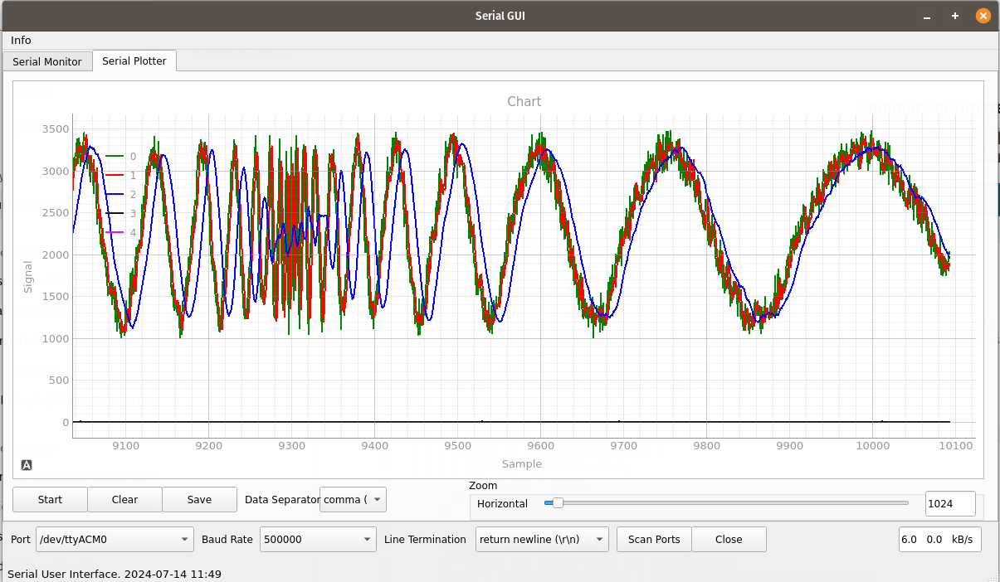
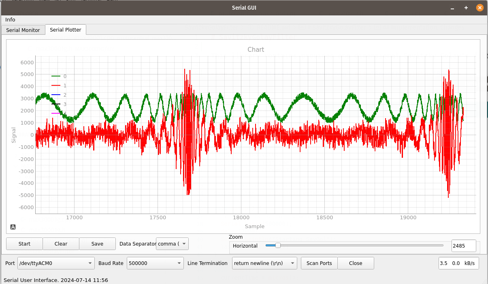

# Savitzky-Golay Filter

This library provides one dimensional Savitzky-Golay's filtering algorithm.
This filter better smooths data with peaks and valleys such as electro cardio gram or spectra with narrow peaks.

Example smoothing and differentiation is shown in the figures below.

Diagram showing short and long windowlength using 2nd order polynomia smoothing.
There is signal delay matching half the window length and decrease of fidelity at high frequencies.

Diagram showing differentiation using short window length. Derivative increases when osciallation increases. Short window length picks up noise.

The figures were created with [Serial UI](https://github.com/uutzinger/SerialUI).

## Documentation

Documentation can be found within the papers in the extras folder as well as below.

## Implementation

SavGol filter approximates a polynomia to the data. A window is shifted over the data and the center point of the window is replaced with the point of the fit.
One can calculate the derivative of the polynomium and compute derivatives instead of smoothed data.

This can also be implemented as a convolution, where the kernel is computed in advance.

## Changes

The orginal Arduino code was developed by James Deromedi.
This fork was created by Urs Utzinger.

It provides python code to compute the filter coefficients, so you can extend the library with your own filter kernels. The python code provides scaling so that the coefficients can be stored as integers.
The SciPy signal module is used. Most recreated kernels match the original published ones. 
The original Savitzky Golay paper had scaling facators up to 4E8. Here they are limitted to a max of a 16 bit integer * max of the window width.

The code provides a small and large version of the filter tables for shorter and longer window sizes. This results in smaller or larger memory use.

The convolution was rewritten for speed and simplicity.
A ring buffer was implemented and data can be int32, float or double. 

One filter update on 25 values takes about 3-4 microseconds on ESP32.

## Testing
Code was not extensively tested, however the calculation of the coefficients was compared with the orginal paper and its updates. For efficiency improvements, ChatGPT was consulted.

Urs Utzinger,
July 2024

## Mathematical Explanation

by ChatGPT4o, July 2024

The Savitzky-Golay filter is a digital filter that is used to smooth data and differentiate data points while preserving the shape and features of the signal. It works by fitting successive polynomial functions to a window of data points using the method of least squares. Here's a step-by-step explanation of the basic math behind the Savitzky-Golay filter:

### 1. Polynomial Fitting
The core idea of the Savitzky-Golay filter is to fit a polynomial of degree $k$ to a set of $2m+1$ data points (a window of size $2m+1$).

### 2. Data Points and Window
Consider a set of data points $y_i$ where $i = -m, -m+1, ..., 0, ..., m-1, m$. These points are centered around a point $y_0$ that we are interested in smoothing.

### 3. Polynomial Equation
The polynomial of degree $k$ can be expressed as:
$y = a_0 + a_1 x + a_2 x^2 + ... + a_k x^k$

### 4. Least Squares Method
To find the coefficients $a_0, a_1, ..., a_k$ of the polynomial, we minimize the sum of the squares of the differences between the actual data points and the polynomial values. This is done using the least squares method.

$\min \sum_{i=-m}^{m} \left( y_i - \sum_{j=0}^{k} a_j x_i^j \right)^2$

### 5. Matrix Formulation
The least squares fitting can be formulated in matrix form. Define a matrix $X$ where each row corresponds to a data point and each column corresponds to a power of $x$:

$X = 
\[
\begin{bmatrix}
1 & x_{-m} & x_{-m}^2 & \cdots & x_{-m}^k \\
1 & x_{-m+1} & x_{-m+1}^2 & \cdots & x_{-m+1}^k \\
\vdots & \vdots & \vdots & \ddots & \vdots \\
1 & x_{m} & x_{m}^2 & \cdots & x_{m}^k
\end{bmatrix}
\]$

And a vector $\mathbf{y}$ of the data points:

$\mathbf{y} = \begin{bmatrix}
y_{-m} \\
y_{-m+1} \\
\vdots \\
y_{m}
\end{bmatrix}$

### 6. Solving for Coefficients
The coefficients $\mathbf{a} = \begin{bmatrix} a_0 & a_1 & \cdots & a_k \end{bmatrix}^T$ are obtained by solving the normal equations:

$\mathbf{a} = (X^T X)^{-1} X^T \mathbf{y}$

### 7. Convolution Coefficients
The convolution coefficients used in the Savitzky-Golay filter are derived from the polynomial coefficients. These coefficients form the filter's impulse response and can be precomputed for a given window size and polynomial degree.

### 8. Applying the Filter
To smooth the data, the precomputed convolution coefficients are applied to the data points within the window using convolution:

$y_0' = \sum_{i=-m}^{m} c_i y_i$

Where $c_i$ are the convolution coefficients.

### Summary
The Savitzky-Golay filter fits a polynomial to the data points within a moving window and then uses the polynomial to smooth the data. This process preserves the higher moments of the data, such as the peak heights and widths, making it useful for smoothing noisy data while maintaining the signal's features.

### Further Reading
For more detailed information and implementation examples, refer to:
- [Savitzky-Golay filter on Wikipedia](https://en.wikipedia.org/wiki/Savitzky%E2%80%93Golay_filter)
- [Savitzky-Golay filter in numerical recipes](https://numerical.recipes)
- [Implementation in Python using SciPy](https://docs.scipy.org/doc/scipy/reference/generated/scipy.signal.savgol_filter.html)
